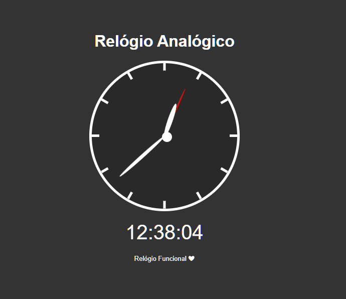

# projeto-relogio-digital-e-analogico

 

<h3 align="center">"Relógio analógico e digital  com HTML, CSS e JAVASCRIPT". </h3>
 

<h2 align="center">Sobre 📖</h2>
   
   

      O projeto tem como objetivo, sobretudo, praticar conceitos de Javascript. ⚙
   

 

---

<h2 align="center">Preview 🖥️</h2>

 

   

      
   

 

  * Veja o projeto em funcionamento aqui: [Relógio Digital](https://italo-maia.github.io/projeto-relogio-digital-e-analogico/) 🖱.
 